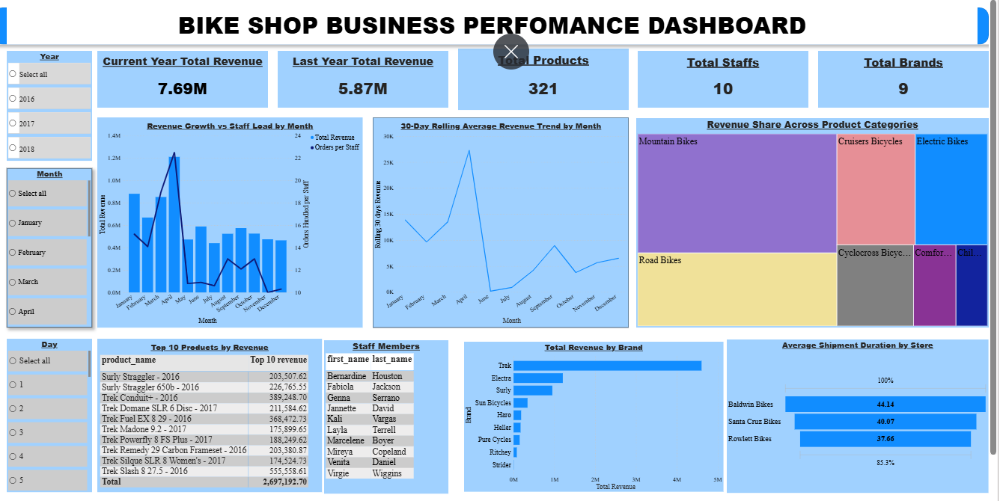
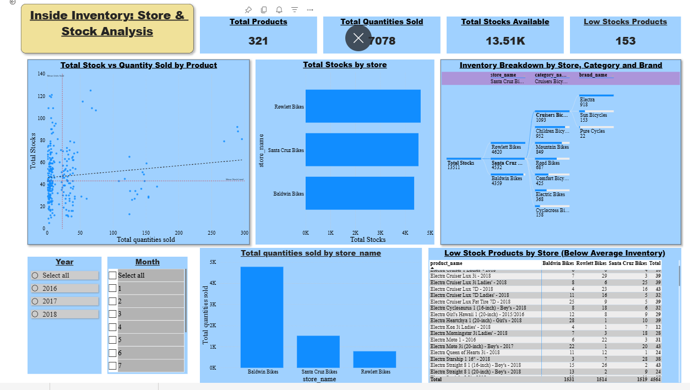

# 📊 Bike-Sales-Analysis

---

## 🔹 Project Overview

This project is a deep dive into a high-end bike shop that was doing great until it hit a major speed bump. In 2016 and 2017, the business was booming, but by 2018, sales suddenly dropped by nearly **half (47%)**.

I used the **Bike Shop Dataset** to play a detective. I wanted to find out if the shop was losing customers, running out of popular bikes, or if the staff just couldn't keep up with the workload.

By looking at three years of sales, inventory, and shipping data, I identified exactly where the money was leaking and how to plug the holes for 2019.

---

### 🔹 Project Sections

I broke my findings into four clear sections:

1. **The Executive Dashboard**  
   - This page acts as a quick overview or summary of the business's entire ecosystem.

2. **Inside Inventory**  
   - This page focuses on product and store breakdown.

3. **Staff Performance**  
   - This page shifts the focus from "What" is being sold to "Who" is selling it.  
   - It analyzes how staff members are handling the workload and how their individual performance affects total sales volume.

4. **Staff Drill Through**  
   - This is a detailed page that allows the user to click on any staff member to see their full profile.

---

## 🔹 The Executive Dashboard

---

---

### 🔹 Core Business Questions Addressed

1. **Total Revenue**  
   - What is the total revenue generated per year, and how does each year contribute to the overall revenue across the three-year period?

2. **Growth Sustainability**  
   - Is our **$7.69M** lifetime revenue a sign of healthy scaling?

3. **The 2018 Crash**  
   - What triggered the **47% year-over-year** drop from **$3.45M (2017)** to **$1.81M (2018)**?

4. **Product Volatility**  
   - Which products, categories, or brands perform well in terms of revenue generation?

5. **Monthly Sales**  
   - Are there specific months where bike sales spike?

6. **Operational Spikes**  
   - Are our 10 staff members and 3 store locations capable of handling high-volume seasonal spikes?

---

<b>🔹 Click to expand: Deep-Dive Analysis & Strategy</b>

### 🔹 Key Observations (The "What")

#### 1. The Revenue Trajectory

- **The 2016 Baseline**  
  - Established a stable foundation of **$2.43M**

- **The 2017 Peak**  
  - Scaled rapidly to **$3.45M** *(42% growth)*

- **The 2018 Decline**  
  - Collapsed to **$1.81M** *(47% decline)*

- **The $5.87M Benchmark**  
  - This "Last Year" figure represents our total momentum *(sum of 2016 and 2017 revenue)* before the 2018 crash, proving 2018 is an extreme outlier.

---

#### 2. Market and Brand Composition

- **Brand Monopoly**  
  - A single brand, **Trek**, accounts for nearly **$5M** of all-time revenue.

- **Category Shift**  
  - All-time, **Mountain Bikes ($2.71M)** lead the shop. However, in 2018, **Road Bikes ($619K)** overtook Mountain Bikes for the first time.

- **Top Performing Products**  
  - The **Trek Slash 8 ($555K)** is our highest-grossing product, but it is a 2016 model.

---

#### 3. Operational Performance

- **The April Surge**  
  - 2018 saw a massive revenue spike in April (**$0.8M**), forcing a **"Staff Load" of 13 orders per person**.

- **The Shipping Bottleneck**  
  - Baldwin Bikes is our slowest location, taking **44 hours** to ship over the three years, compared to **38 hours** at Rowlett.

---

### 💡 Strategic Insights (The "Why")

---

#### 1. Sustainability & Volatility

- **The "Extreme Outlier" Risk**  
  - The 47% collapse in 2018 isn't just a slow year; it is a sign of a fragile business model.  
  - By comparing 2018 to the **$5.87M momentum** of previous years, it’s clear the business failed to adapt after its peak growth, leading to a **"boom-and-bust" cycle** rather than steady scaling.

---

#### 2. Portfolio & Product Health

- **The Dependency Trap**  
  - With **Trek accounting for nearly $5M** of revenue, the company is dangerously over-reliant on a single partner.  
  - Any supply chain issue or price hike from Trek would immediately jeopardize the entire business.

- **Innovation Lag**  
  - Our #1 earner is a **2016 model**.  
  - The shift in 2018, where **Road Bikes overtook Mountain Bikes**, suggests that customers have moved on to new trends, while our inventory remained stuck in the past.  
  - We didn't lose the market; we lost our **"product-market fit."**

---

#### 3. Operational Friction

- **The Service-Revenue Link**  
  - Baldwin Bikes handles a massive volume but suffers from a **44-hour shipping delay**.  
  - This **6-hour gap** compared to Rowlett isn't just a number — it represents frustrated customers.  
  - In a high-end market, a **2-day wait** for a premium bike can lead to **"Brand Damage."**

- **The Volume-Pressure Connection**  
  - *[Detailed in the "Inside Inventory" Page]*  
  - The reason for this delay becomes clear when we look at store performance.  
  - Baldwin Bikes alone handled **4,779 units** — nearly **68%** of the company's total **7,078 sales**.  
  - The store isn't "slow" because of inefficiency; it is simply overwhelmed by a volume it wasn't built to handle.  
  - The 2018 decline is likely a result of this operational bottleneck reaching a breaking point during peak months.

---

### 💡 Strategic Recommendations (The "How")

---

#### 1. Stabilizing the Revenue Cycle

- **Counter-Seasonality Strategy**  
  - The business currently relies heavily on a single peak period (April), creating a **"one-season trap."**  
  - To stabilize revenue throughout the year, the business should introduce campaigns in **Q3 and Q4**.  
  - Using the historical **October spike (2016)** as a guide, launch a **Fall Service & Commuter Event** focused on hybrid and electric bikes.  
  - This will help fill revenue gaps in the second half of the year and reduce over-dependence on one peak season.

---

#### 2. Portfolio & Inventory Refresh

- **Brand De-Risking**  
  - The business must reduce its **65% dependency on Trek**.  
  - Introduce a **strategic expansion** of the **Electra ($1M)** and **Surly ($995K)** product lines to account for at least **40% of floor space**.  
  - This creates a safety net in case of supply chain or pricing issues with Trek.

- **Cycle-Out Aging Stock**  
  - Since top-performing products are still **2016 models**, a **liquidation event** should be conducted to clear older inventory.  
  - The freed-up capital should be reinvested into **2018/2019 Road and Mountain models** to align with current market demand.

---

#### 3. Solving the Baldwin Bottleneck

- **Dynamic Resource Allocation**  
  - *[Detailed in the "Inside Inventory" Page]*  
  - Baldwin Bikes handles nearly **68% (4,779 units)** of total company sales.  
  - Instead of equal staffing across all stores, reallocate **2–3 staff members** from Rowlett (low volume but efficient) to Baldwin during peak seasons.  
  - This will help reduce the **44-hour shipping delay**.

- **Operational Standardizing**  
  - Analyze the **38-hour workflow at Rowlett** and apply those **best practices** to Baldwin.  
  - Reducing Baldwin’s delay by even **6 hours** can significantly improve customer satisfaction and retention.  
  - This will help prevent the **"Brand Damage"** observed in 2018.
---

---

## 🔹Inside Inventory Analysis

---

---

**Project Context:**  
An inventory audit was conducted to assess whether **product availability and stock distribution** contributed to the decline in sales performance.

---

### **❓ Key Business Questions**

- **The Availability Paradox**  
  With over **13,000 units currently in stock**, the key question is whether this inventory acts as a **safety buffer** to support sales or represents **idle capital** tied up in products that are not in demand.

- **High-Demand Product Availability**  
  Out of **321 unique products**, it is critical to understand how many are actually available in **high-traffic stores**. There is concern that high-demand items—particularly popular **2018 Trek models**—may be out of stock, leading to missed sales opportunities.

- **Geographic Alignment of Inventory**  
  Inventory distribution needs to be evaluated against **store performance**. Specifically, comparing **sales velocity and stock levels** between:
  - **Baldwin (high-volume store)**  
  - **Rowlett (low-volume store)**  
  This helps determine whether products are positioned where demand is highest.

- **Category Alignment with Revenue Drivers**  
  While **Mountain Bikes** are the primary contributors to revenue, a significant portion of inventory consists of **Cruiser Bikes**. This raises the question of whether the current inventory strategy is aligned with actual sales and revenue patterns.

<b>🔹 Click to view Insid Inventory Analysis</b>

### **Key Observations (The “What”)**

- **Overstock vs. Sales Gap**  
  Over the past three years, total sales amounted to **7,078 units**, while the current inventory stands at **13,511 units**. This indicates that the business is holding **almost double** its historical sales volume in stock, suggesting significant overstocking.

- **Low-Stock Concern**  
  Out of **321 products**, **153 (48%)** are classified as “low stock,” meaning their quantities have fallen below the critical average level. This creates a risk of stockouts and potential loss of sales.

  - For example, high-demand **2018 models** such as the *Trek Domane SLR Frameset* have only **5 units remaining across all stores**, with **zero available in the high-volume Baldwin store**.  
  - Similarly, the *Electra Superbolt 3i (2018)* has only **9 units remaining across all stores**, indicating limited availability for popular products.

- **Store Performance Mismatch**  
  There is a clear imbalance between sales performance and inventory allocation across stores:
  - **Baldwin Bikes** is the top-performing store, generating **4,779 units in sales**, yet it holds the **lowest inventory at 4,359 units**.  
  - **Rowlett Bikes**, on the other hand, has the **lowest sales (783 units)** but maintains the **highest inventory at 4,620 units**.

- **Category Overload**  
  Inventory distribution across product categories is not aligned with demand.  
  - **Cruiser Bicycles** are the most overstocked category across all stores (for example, Rowlett alone holds **1,148 units**).  
  - However, **Mountain Bikes**, which are the primary revenue drivers, are not proportionately stocked, indicating a misalignment between inventory and actual demand.

---

### **Strategic Insights (The “Why”)**

- **Inverse Correlation Issue**  
  There is a critical mismatch between sales performance and inventory allocation. The highest-performing store, **Baldwin**, is understocked, while the lowest-performing store, **Rowlett**, is holding excess inventory. This imbalance limits sales potential and increases the risk of unsold stock.

- **Missed Opportunity in 2018 Models**  
  The low availability of popular **2018 models** such as *Trek Domane* and *Electra Superbolt* indicates poor demand forecasting. These products are in high demand but are not sufficiently available in key locations like Baldwin, resulting in missed revenue opportunities.

- **Capital Inefficiency**  
  A significant amount of capital is tied up in slow-moving inventory. For example, holding **1,148 Cruiser bicycles** in a low-sales store like Rowlett means funds are locked in products that are not generating returns. This capital could have been better invested in high-demand products like **Trek SLR framesets** in high-performing stores.

### **Strategic Recommendations (The “How”)**

- **Internal Inventory Redistribution**  
  Reallocate inventory across stores to better match demand. For example, transfer approximately **40% of Cruiser bicycles** from **Rowlett** to **Baldwin** to improve sales potential and reduce excess stock in low-performing locations.

- **Urgent Restocking of High-Demand Products**  
  Prioritize restocking of the **153 low-stock products**, especially high-demand 2018 models. Immediate focus should be placed on supplying **Trek Domane SLR Framesets** to **Baldwin** to prevent complete stockouts and capture ongoing demand.

- **Adopt Store-Specific Stocking Strategies**  
  Replace the current “equal stocking” approach with tailored inventory strategies:
  - **Baldwin** should adopt a **high-velocity stocking model**, focusing on fast-moving categories such as Road and Mountain bikes.  
  - **Rowlett** should reduce the amount of stock it holds and focus on displaying a smaller selection of products, rather than keeping large quantities that are not selling.

---

## **Staff Performance & Operational Efficiency**

---

---
**Project Context:**  
Following the 2018 revenue decline, an analysis was conducted on **staff performance and workload** to determine whether operational inefficiencies contributed to shipping delays—particularly the **44-hour fulfillment time** at high-volume locations.

---

### **❓ Key Business Questions**

- **Workload Distribution**  
  Is sales performance evenly distributed across staff, or is the workload concentrated among a few high-performing individuals?

- **Speed vs. Volume Trade-off**  
  Does handling a high number of orders lead to slower delivery times and reduced service efficiency?

- **Operational Efficiency**  
  Which staff members are delivering the best results by balancing **high sales performance** with **fast order fulfillment**?

- **Product Focus**  
  Are top-performing staff prioritizing high-revenue products such as **Mountain and Road bikes**, or spending time on lower-value items?

---

<b>📂 Click to view Staffing Insights & Performance Matrix</b>

### **🔍 Analysis Results**

---

### **I. Key Observations (The “What”)**

- **High Dependence on Top Performers**  
  Two employees—**Marcelene** and **Venita**—handle nearly **65% of all orders**, indicating a heavy reliance on a small portion of the team.  
  - Marcelene: **553 orders ($2.7M revenue)**  
  - Venita: **540 orders ($2.6M revenue)**  
  - In comparison, the bottom four employees combined handle significantly fewer orders than a single top performer.

- **Shipping Delays Increase with Workload**  
  Employees handling more orders tend to have longer shipping times:  
  - High-volume staff (Marcelene, Venita): **44–45 hours**  
  - Lower-volume staff (e.g Kali): **~37 hours**

- **Strong Efficiency from Mid-Level Performer**  
  **Genna** stands out by maintaining a strong balance between sales and speed:  
  - Generated **$853K (3rd highest revenue)**  
  - Maintained a **fast 38-hour shipping time**  
  - Outperformed some lower-volume staff in both speed and efficiency

- **Focus on High-Value Products**  
  Top performers are driving revenue by focusing on key product categories:  
  - Marcelene: **$930K (Mountain Bikes)** + **$576K (Road Bikes)**  
  - Venita: **$906K (Mountain Bikes)** + **$563K (Road Bikes)**  

---

### **II. Strategic Insights (The “Why”)**

- **Over-Reliance on Few Employees**  
  The longer shipping times for Marcelene and Venita are not due to poor performance, but **excess workload**. The business depends too heavily on them, creating a risk—if one leaves, a significant portion of revenue is affected.

- **Performance Gap Among Staff**  
  Some employees, such as **Layla**, handle fewer orders but still take longer to fulfill them compared to others like Genna. This suggests a need for **process improvement or additional training**.

- **Clear Revenue Drivers**  
  The strong performance of Mountain and Road bikes confirms that focusing on these categories is the right strategy for maximizing revenue.

---

### **III. Strategic Recommendations (The “How”)**

- **Improve Workload Distribution**  
  Balance responsibilities across the team. For example, **Genna can support or mentor Layla** to improve efficiency and consistency in order handling.

- **Provide Support for High Performers**  
  During peak periods (such as April), introduce temporary support staff to assist with packaging and shipping. This allows top performers to focus on sales while maintaining faster delivery times.

- **Introduce Efficiency-Based Incentives**  
  Develop a performance system that rewards not only total sales but also **speed and efficiency**. This encourages all staff to improve both productivity and service quality.

